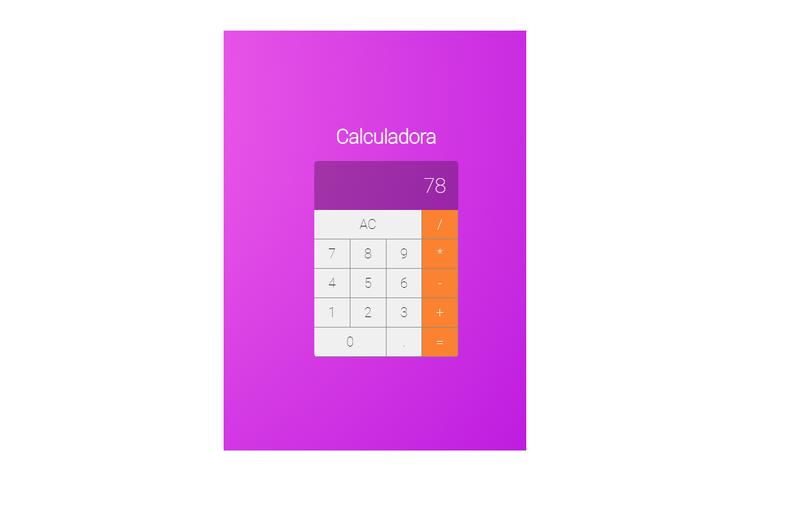

Curso de Reactjs que eu estava fazendo a 2 anos atras
Refazendo o curso denovo para relembrar de algumas coisas do Reactjs

# Tarefas que ate agora eu fiz
 
Feito a calculado - OK.

 
Trabalhando no backend do todo-list para relembrar. Em desenvolvimento

# projeto da calculadora

Foto da calculado que foi feita no curso
